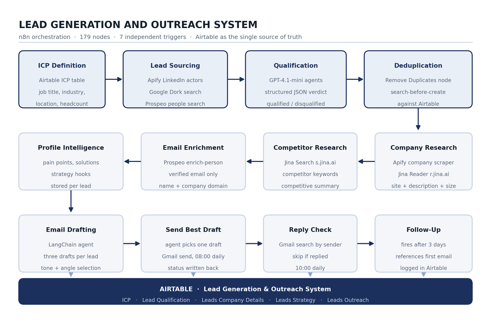
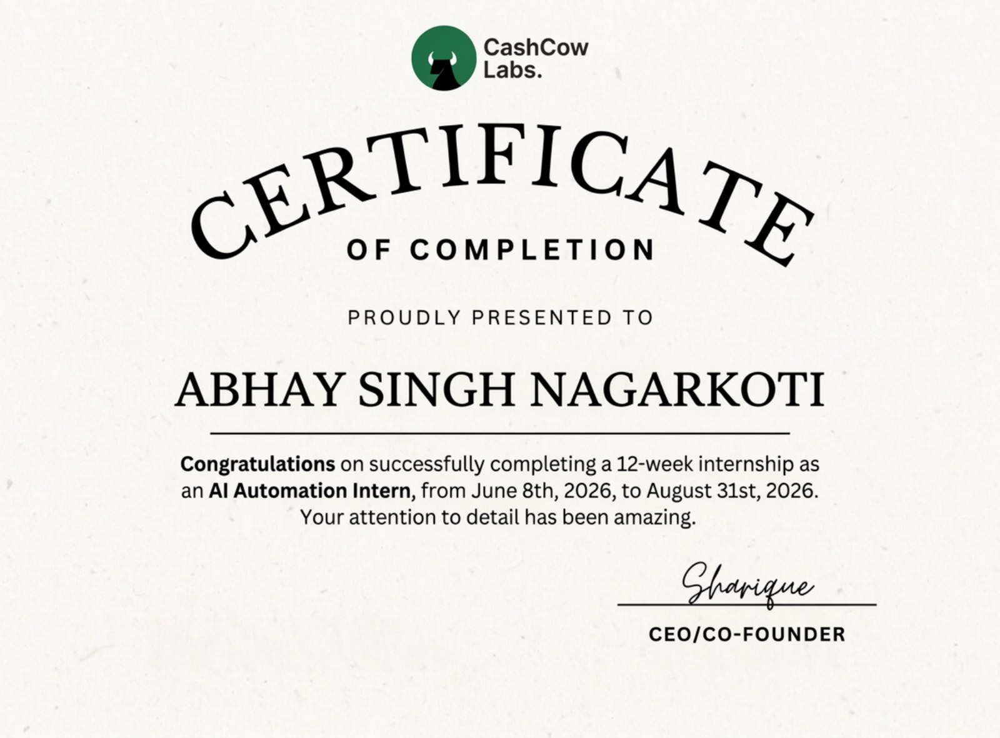

<h1 align="center">AI Automation Internship</h1>

<b>Lead Generation and Outreach System</b> 
A 12-week internship at CashCow Labs · IILM University, Greater Noida

---

| | |
|---|---|
| **Intern** | Abhay Singh Nagarkoti |
| **Roll Number** | 2410030450 |
| **Section / Batch** | 3CSE3 · 2024-28 · 5th Semester |
| **Institute** | IILM University, Greater Noida |
| **Organization** | CashCow Labs, Wyoming, USA |
| **Role** | AI Automation Intern |
| **Duration** | 8 June 2026 – 31 August 2026 (12 weeks) |
| **Mode** | Remote |
| **Reporting To** | Sharique, CEO and Co-Founder |

---

## Contents

- [The Problem](#the-problem)
- [What the System Does](#what-the-system-does)
- [Architecture](#architecture)
- [The Seven Pipelines](#the-seven-pipelines)
- [Technologies and Tools](#technologies-and-tools)
- [Data Model](#data-model)
- [Design Decisions](#design-decisions)
- [Results](#results)
- [Problems Hit Along the Way](#problems-hit-along-the-way)
- [Repository Contents](#repository-contents)
- [Internship Certificate](#internship-certificate)
- [Running It Yourself](#running-it-yourself)

---

## The Problem

Outbound sales is repetitive, but it is not simple. Doing it properly for one prospect means finding people who match a customer profile, checking the role is current rather than a headline from two years ago, reading the company, working out what problems it likely has, writing an email that refers to those specific problems, sending it, then following up without ever following up with someone who already replied.

Done carefully, that is **15 to 20 minutes per prospect**. About twenty five prospects in a working day, with research quality dropping as the day goes on. The usual response is to abandon research and send the same email to a thousand people, which is why most cold email is ignored.

The gap sits between two bad options: manual research produces good emails at a volume too low to matter, and mass mailing produces volume with no relevance. Existing sales tools mostly automate the sending, which is the easy part.

**This project keeps the quality of manual research while removing the manual time, and stays pointable at a completely new customer profile without any of its logic being rewritten.**

## What the System Does

Given an Ideal Customer Profile defined as data, the system:

1. **Sources** leads through one of three switchable routes
2. **Qualifies** each one against the profile, with a written reason recorded for both acceptance and rejection
3. **Researches** the prospect's company and its competitors
4. **Enriches** the record with a verified email address, skipping the lead rather than guessing when none exists
5. **Derives** pain points, matched solutions and engagement hooks
6. **Drafts** three distinct emails, selects one, and sends it
7. **Follows up** after three days, only where Gmail shows no reply

179 nodes. Seven independent pipelines. Runs unattended on a schedule and recovers on its own when an external service fails.

## Architecture

The system is **not one long chain**. It is seven independent pipelines sharing one Airtable base. Each has its own trigger, reads the records ready for it, does its work, writes the result back, and sets a completion flag. No pipeline calls another directly.

This is the single most important decision in the design, and the reason is practical. A lead passes through scraping, qualification, company research, competitor research, enrichment, analysis, drafting, sending and follow-up. Run as one chain, that is a workflow lasting several minutes per lead that fails completely if any one API call times out. Split into seven, a failure in the enrichment stage leaves every record that already passed qualification safely stored, and the enrichment stage simply picks them up on its next run.

## The Seven Pipelines

| # | Pipeline | Trigger | Nodes | What it does |
|:--|:--|:--|--:|:--|
| 1 | Lead Sourcing and Qualification | Webhook | 46 | Routes each profile to one of three sourcing methods, scrapes, deduplicates and qualifies |
| 2 | Company and Competitor Analysis | Every 3 hours | 32 | Scrapes company details, researches the site and competitors through Jina |
| 3 | Profile Intelligence | Hourly | 18 | Writes an intelligence document, then derives pain points, solutions and hooks |
| 4 | Email Enrichment | Every 6 hours | 13 | Extracts the domain and calls Prospeo for a verified address |
| 5 | Email Drafting | Every 3 hours | 11 | Feeds the research package to a drafting agent and stores three drafts |
| 6 | Email Sending | Daily at 08:00 | 7 | Selects the strongest draft, sends it and records the sent date |
| 7 | Follow Up | Daily at 10:00 | 9 | Checks Gmail for a reply after three days and follows up only where there is none |

### Three sourcing routes, switchable per profile

| Route | How it works |
|:--|:--|
| **Apify** | LinkedIn Profile Search actor with the job title and filters from the ICP, then the Profile Scraper for full detail |
| **Google Dork** | An LLM chain generates search operators from the ICP, those run through a Google search actor, and the resulting LinkedIn URLs are scraped |
| **Prospeo** | `search-person` called directly with structured filters for title, headcount, industry and location, restricted to records carrying a verified email |

Each route has its own qualification agent, because the shape of the data coming out of the three sources is different. All three return the same structured verdict.

## Technologies and Tools

| Layer | Technology | Why this one |
|:--|:--|:--|
| **Orchestration** | n8n, self-hosted | Triggers, branching, looping, batching, waits and error paths in one place |
| **Lead sourcing** | Apify — `harvestapi/linkedin-profile-search`, `linkedin-profile-scraper`, `linkedin-company`, plus a Google search scraper | The LinkedIn actors are **cookie-free**, so no session token is stored anywhere |
| **Contact data** | Prospeo — `search-person`, `enrich-person` | Verified-only email lookup; a guessed address damages domain reputation |
| **Web research** | Jina AI — `s.jina.ai`, `r.jina.ai` | Returns clean text instead of raw HTML, which matters when feeding a language model |
| **Language models** | OpenAI GPT-4.1-mini, GPT-4o-mini | 4.1-mini for reasoning-heavy stages, 4o-mini for lighter formatting work |
| **Agents** | n8n LangChain nodes | 11 agents, 4 chains, 4 structured output parsers |
| **Database** | Airtable | 5 linked tables, 40 node operations, state visible to a person |
| **Email** | Gmail | Sending through agent tool nodes, plus reply search before follow-up |

<b>Full node composition (179 total, 171 functional)</b>

| Node Type | Count | Purpose |
|:--|--:|:--|
| Airtable | 40 | Read, create, update and upsert across five tables |
| OpenAI Chat Model | 15 | Model nodes attached to agents and chains |
| No Operation | 15 | Terminating branches, making false paths explicit |
| Set (Edit Fields) | 13 | Field mapping and reshaping between stages |
| AI Agent | 11 | Qualification, research, analysis, drafting, sending, follow-up |
| Code (JavaScript) | 11 | Date maths, JSON restructuring, output cleanup |
| Split In Batches | 10 | Loop control for large record sets |
| If | 9 | Conditional branching, mostly guarding empty or duplicate records |
| Wait | 7 | Deliberate pauses to stay inside third-party rate limits |
| Schedule Trigger | 6 | Independent schedules for six of the seven pipelines |
| HTTP Request Tool | 6 | Jina endpoints exposed to agents as callable tools |
| Structured Output Parser | 4 | JSON schema enforcement on model output |
| LLM Chain | 4 | Single-shot generation without tool access |
| Apify | 4 | The four scraping actors |
| Others | 24 | Merge, Switch, Split Out, Gmail, HTTP Request, Webhook, Remove Duplicates, triggers, sticky notes |

## Data Model

Airtable base: **Lead Generation & Outreach System**

| Table | Holds |
|:--|:--|
| `ICP` | Profile definitions — job title, decision maker, location, company size, industry, sourcing method, and a flag for whether leads should currently be generated |
| `Lead Qualification` | Every scraped lead — headline, about, current position, profile URL, qualification status, and the written reason for that status |
| `Leads Company Details` | Description, industry, employee count, locations, specialities, values, target market, key services, tech stack, recent news, competitor analysis |
| `Leads Strategy` | The generated intelligence document, pain points, matched solutions, engagement hooks |
| `Leads Outreach` | Verified email, the three drafts, the selected email, sent status and date, follow-up text and status |

Completion flags on each record (`Profile Analysis Complete`, `Company Analysis Complete`, `Email Drafted`, `Email Sent`, `Follow Up Sent`) act as a **state machine held in the database rather than in memory**. The practical effect is that the system is restartable at any point: stop the drafting stage halfway and the records it already handled are skipped on the next run. Nothing is drafted twice and nothing is lost.

## Design Decisions

**Map the manual process first.** The system was not designed by listing available APIs. It was designed by writing out, in order, what a careful researcher would do for one prospect, then asking which of those steps a machine could do at the same standard. Steps a machine does better, such as reading twenty competitor pages, were expanded. Steps a machine does badly, such as judging whether a reply is positive, were left out of scope entirely. This is why the pipeline has a competitor research stage that no manual process at small scale would include — once the cost drops to a few API calls, it becomes worth doing.

**Decompose the prompts.** Asking one prompt for analysis, pain points and hooks together produced three shallow lists. Splitting it into three chained stages, each reasoning over the output of the last, produced noticeably better results and made the intermediate output debuggable.

**Assume the model will misbehave.** Four structured output parsers enforce a JSON shape, two with auto-fix. Malformed output goes back to the model with the expected schema attached instead of raising an error that stops a scheduled run. This single setting removed most of the failures seen in testing.

**Protect against duplicates twice.** A Remove Duplicates node filters within each batch, and separately, before any lead is created, the workflow searches Airtable by LinkedIn profile URL and routes to an update if a match exists. The first catches repeats inside a run; the second catches repeats across runs, which is the more common case when the same profile appears under two different ICPs.

## Results

| Measure | Outcome |
|:--|:--|
| Manual time per prospect | 15–20 minutes → **zero** once an ICP is configured |
| Sourcing channels | **Three**, switchable per ICP with no change to the workflow |
| Research depth per lead | Company profile, competitor analysis, intelligence document, pain points, solutions, engagement hooks |
| Drafts per lead | **Three** distinct angles generated, one selected automatically |
| Duplicate leads created | **None**, due to the two-layer check |
| Follow-ups to leads who had replied | **None**, due to the Gmail reply check before drafting |
| Recovery after a failed stage | **Automatic** on the next scheduled run, no manual restart, no reprocessing |

The result that mattered most in review was not speed. It was that the emails referred to things a template could not know: a specific service the company had launched, a gap against a named competitor, a claim on their own website.

## Problems Hit Along the Way

| Problem | Fix |
|:--|:--|
| LinkedIn scraping normally needs a session cookie, which expires and ties the system to one account | Moved to cookie-free Apify actors; no session token stored anywhere |
| One API timeout wasted the entire run | Split into seven independent pipelines with state tracked through Airtable flags |
| Models occasionally returned text that was not valid JSON | Structured output parsers with auto-fix |
| The same profile appeared under two ICPs and created duplicates | Batch-level dedupe plus a search-before-create against Airtable |
| Apify and Prospeo rate limits cut batches off partway | Smaller batch sizes and seven wait nodes at the heaviest call points |
| Company website fields held tracking params, subdomains and redirect links | An agent step that extracts and normalises the domain before enrichment |
| Follow-ups risked reaching prospects who had already replied | Gmail search against the prospect's address before any follow-up is drafted |
| Sent dates stored as `DD/MM/YYYY`, which JavaScript does not parse correctly | Code node that splits the string and constructs the date explicitly, normalising both to midnight before comparing |

## Repository Contents

| File | Contents |
|:--|:--|
| [`Internship_Report_Abhay_Singh_Nagarkoti.pdf`](Internship_Report_Abhay_Singh_Nagarkoti.pdf) | Full internship report in university format, 16 chapters, 23 pages |
| [`Internship_Presentation_Abhay_Singh_Nagarkoti.pdf`](Internship_Presentation_Abhay_Singh_Nagarkoti.pdf) | Presentation deck, 18 slides |
| [`Abhay Singh Nagarkoti Internship Certificate.pdf`](Abhay%20Singh%20Nagarkoti%20Internship%20Certificate.pdf) | Completion certificate issued by CashCow Labs |
| [`leadgen_workflow.json`](leadgen_workflow.json) | Complete n8n workflow export, all 179 nodes |

## Internship Certificate

<i>Issued by CashCow Labs for a 12-week internship as AI Automation Intern, 8 June 2026 to 31 August 2026. 
Signed by Sharique, CEO and Co-Founder. Full PDF: <a href="Abhay%20Singh%20Nagarkoti%20Internship%20Certificate.pdf">here</a>.</i>

## Running It Yourself

1. Import `leadgen_workflow.json` into an n8n instance (self-hosted or cloud).
2. Create the Airtable base with the five tables described in [Data Model](#data-model), or duplicate the schema from the field lists in Annexure A of the report.
3. Attach your own credentials. The export ships with **all API keys and credential references replaced with placeholders** — nothing in this repository is a live secret.
   - OpenAI API key
   - Airtable personal access token
   - Apify API token
   - Prospeo API key (`X-KEY` header on both HTTP Request nodes)
   - Gmail OAuth credential
4. Populate the `ICP` table with at least one profile and set `Generate Leads for this ICP?`.
5. Enable the schedule triggers. Pipeline 1 fires from a webhook; the rest run on their own schedules.

> **Note on scale.** The wait nodes and batch sizes are tuned for the rate limits of the accounts this ran on. If you use different plan tiers, retune those before running at volume.

## License

Shared for academic and portfolio purposes only. No client data, no live credentials, and no proprietary material from CashCow Labs or its clients is included.
